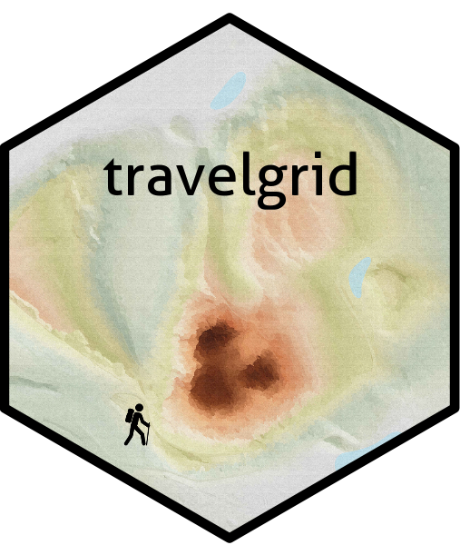
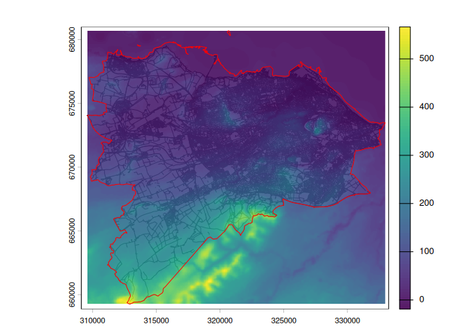
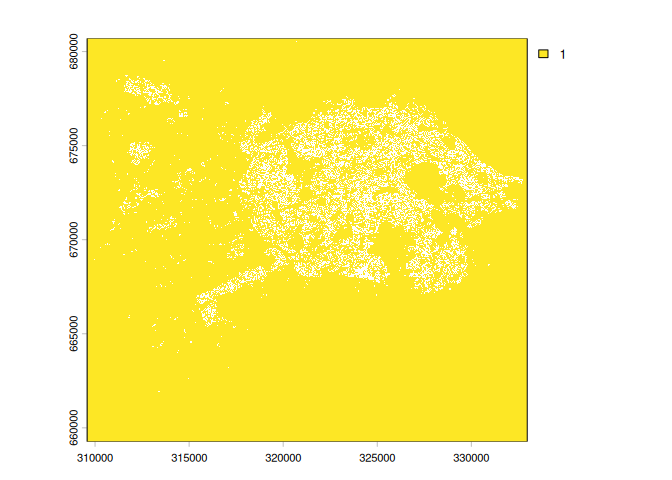
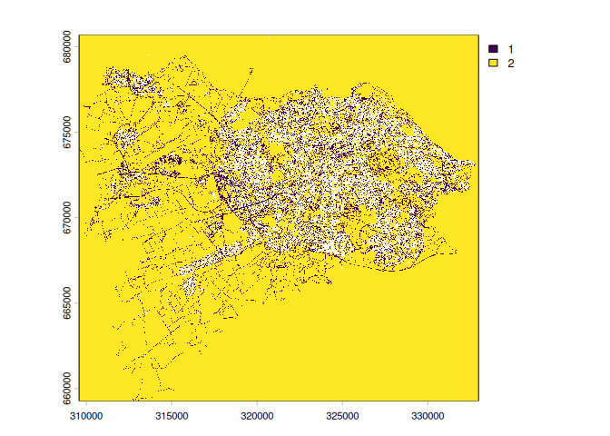
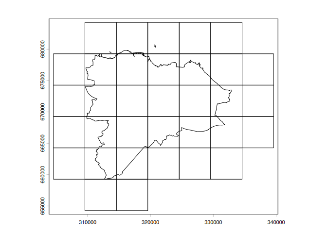
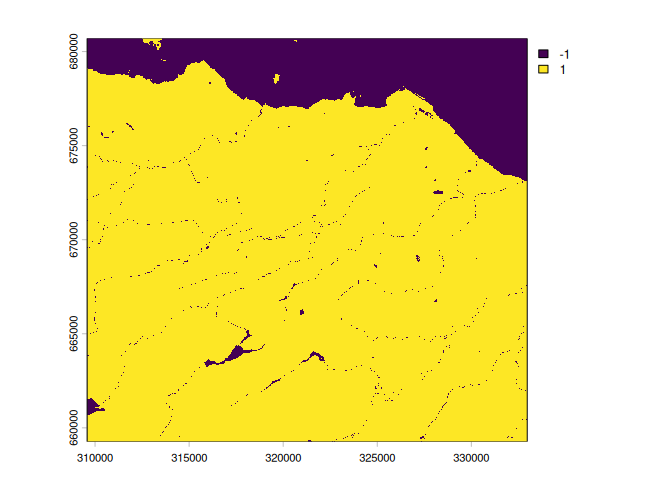
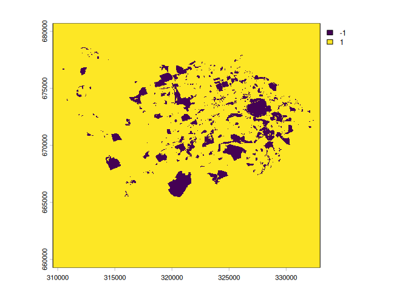
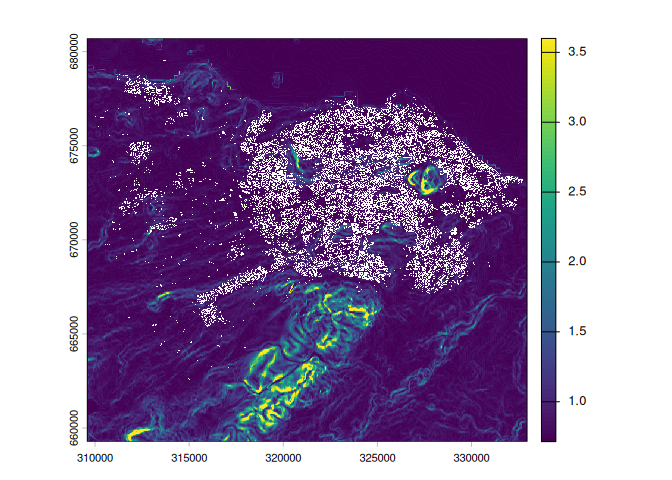
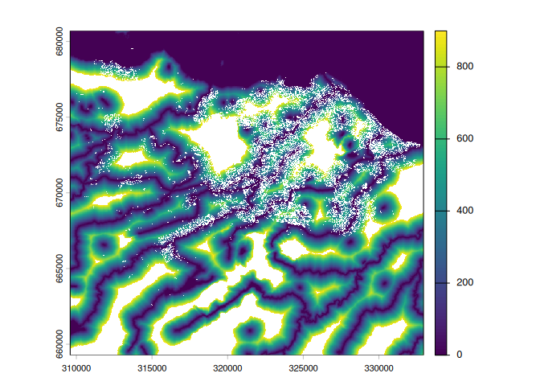
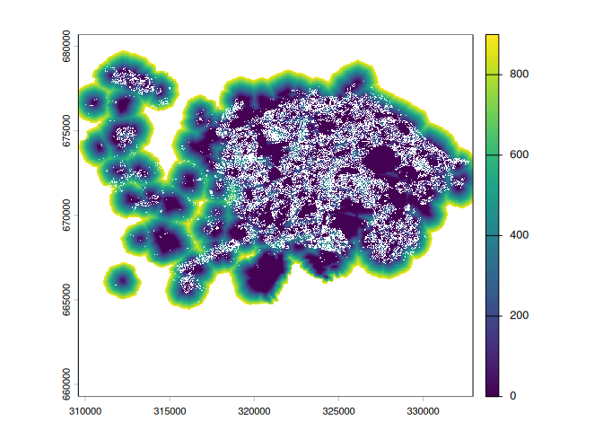

<!-- README.md is generated from README.Rmd. Please edit that file -->

# travelgrid



<!-- badges: start -->

<!-- badges: end -->

The goal of travelgrid is to Measures the time taken to travel somewhere
through a landscape. It is fast, scalable, and is built to handle
many-to-many least-cost travel time computation where the built
environment and topography matter.

## Installation

You can install the development version of travelgrid like so:

``` r
remotes::install_github("chrislittleboy/travelgrid")
```

## Input data

Here, we load road and building footprint data for Edinburgh, downloaded
directly from Open Street Maps. We also require a Digital Elevation
Model, which can be downloaded using the *elevatr* package.

``` r
library(travelgrid)
library(terra)
#> terra 1.9.46
buildings <- retrieve_buildings()
roads <- retrieve_roads()
dem <- retrieve_dem()
edinburgh <- retrieve_edinburgh()
plot(roads)
plot(dem, add = TRUE, alpha = 0.9)
plot(edinburgh, add = TRUE, col = NA, border = "red")
```



## Built environment

Our travel time algorithm assumes that people cannot travel through
buildings, but that they might travel at a different speed if they are
on a road. The *get_built_environment* function extracts this
information from the road and building footprint data. A template grid
is created with a specified resolution, here set at 10m. Pixels with
buildings covering them are set a NA value. Pixels with a road and a
building covering them are set as a road so that travel through the
pixel is possible. Pixels with just a road are assigned a value of
*road_travel*. Pixels with neither a road or a building are assigned a
value of *off_road_travel*. Defaults set both values so that walking
speeds are determined purely by the slope and Tobler’s hiking function.

``` r
template <- rast(edinburgh, res = 10)

built_environment <- get_built_environment(buildings = buildings,
                                           roads = roads,
                                           template = template)

built_environment_off_road_adjustment <- get_built_environment(
                                           buildings = buildings,
                                           roads = roads,
                                           template = template,
                                           road_travel = 1,
                                           non_road_travel = 2)

plot(built_environment, maxcell = 1000000)
```



``` r
plot(built_environment_off_road_adjustment, maxcell = 1000000)
```



## Grids and performance

To allow for memory safety, and parellisation, the processing is done by
taking regular grids over the environment. A *gridsize* is defined, here
it is 2.5km. The landscape is divided into regular squares of
2.5km<sup>2</sup>, each given a unique *id*.

``` r
gridsize <- 5000
grid <- make_grid(edinburgh, gridsize)
plot(grid)
plot(edinburgh, add= TRUE)
```



## Destinations

Destinations are defined using polygon data. Two helper functions are
included, to transform polygon input data into the required format. With
the *get_target_multisource* function, a list of files which can be read
using *terra*’s *vect* function is supplied. With the
*get_target_onesource* function, a single *SpatVector* is supplied.
These are classified spatially using the same template as the built
environment. If a pixel contains a target, it is set to -1, otherwise it
is set to 1. This is illustrated for Edinburgh using bluespace
(combining Scotland Environmental Protection Agency data on coasts,
rivers, estuaries and UK Lakes data on lochs) and greenspace (using data
supplied by the UK Ordnance Survey).

``` r

bluespace_sources <- list.files("./inst/extdata/bluespace", full.names = TRUE)
bluespace_sources <- bluespace_sources[which(tools::file_ext(bluespace_sources) == "shp")]
bluespace <- get_target_multisource(bluespace_sources, template)

greenspace_source <- vect("./inst/extdata/greenspace.shp") # gets os greenspace data
greenspace <- get_target_onesource(greenspace_source, edinburgh, template)

plot(bluespace)
```



``` r
plot(greenspace)
```



## Friction

The seconds to cross a pixel are calculated using data on the the built
environment and the DEM. People are assumed to walk at a speed according
to Tobler’s hiking function. Friction values represent the number of
seconds it takes to travel 1 meter, based on the slope. These speeds are
adjusted based on the built environment.

``` r
friction_grid <- lapply(FUN = get_friction,
                        X = 1:nrow(grid),
                        grid = grid,
                        gridsize = gridsize,
                        resolution = xres(template),
                        built_environment = built_environment,
                        dem = dem)

fg <- mosaic(sprc(friction_grid), fun = "mean")
plot(trim(fg))
```



## Travel times

Travel time from any point on the surface to our targets is calculated
by combining information on targets with the friction grid. Here is a
travelgrid showing the travel time (in seconds) to green spaces and blue
spaces in Edinburgh. All areas within 15 minutes walk are plotted.

Warnings are produced whenever there is no target within a friction
grid. Grids are expanded by 50% of the grid size parameter to reduce
spatial edge effects. A grid size of 2.5km<sup>2</sup> guarantees that,
on the flat, any target within 15 minutes will be reached. For problems
where targets are sparse, and precision for long travel times is
important, users should define a larger grid size.

``` r
bluespace_travel_grid <- lapply(target = bluespace, X = friction_grid, FUN = get_travel_time)
greenspace_travel_grid <- lapply(target = greenspace, X = friction_grid, FUN = get_travel_time)
#> Warning: [costDist] no target cells found
#> Warning: [costDist] no target cells found
#> Warning: [costDist] no target cells found
#> Warning: [costDist] no target cells found
#> Warning: [costDist] no target cells found
#> Warning: [costDist] no target cells found

bstt <- mosaic(sprc(bluespace_travel_grid), fun = "min")
gstt <- mosaic(sprc(greenspace_travel_grid), fun = "min")
plot(trim(bstt), range = c(0,900))
```



``` r
plot(trim(gstt), range = c(0,900))
```



## Usability

The package has been designed to take widely available open data, and to
produce travel grids at a high spatial resolution. Our worked example
could be used to inform planning decisions for local parks, or social
proscribing. But the code is flexible to any target of interest
(schools, hospitals, cinemas, etc.) over any area.
